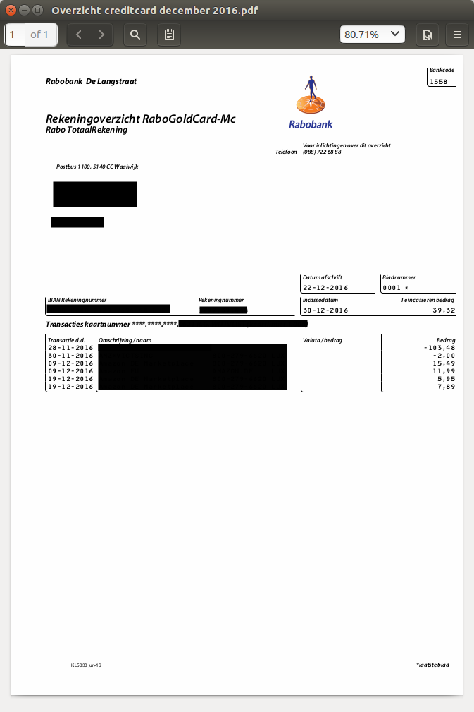
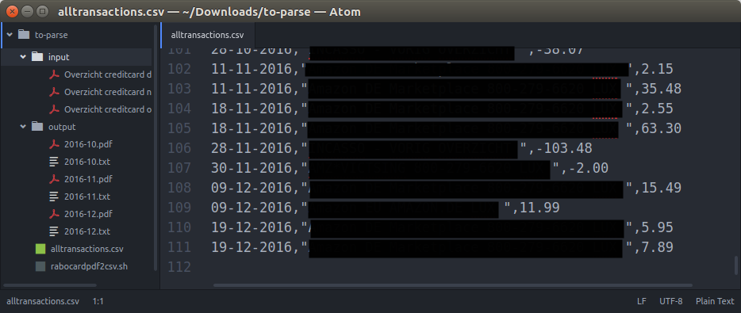

# rabocardPdf2Csv
Script to extract transaction information from Rabobank PDF bank statements into CSV. 

## The Problem

For 'Rabo Totaalrekening', 'Rabo Spaarrekening' etc, the Dutch bank Rabobank offers downloading the transactions as CSV files, for import into accounting software (e.g., [Gnucash](https://www.gnucash.org/)).

For the Mastercard ('Rabocard') statements, however, only PDF files can be downloaded, which cannot be easily imported anywhere. Here is an example:


## The Solution

The bash script `rabocardpdf2csv.sh` takes the pdf files in the `input` folder, processes them and puts them into the `output` folder. Then, all transactions in these files are put into the file `alltransactions.csv`:




## Dependencies and Assumptions

`rabocardpdf2csv.sh` assumes to find:

* a folder `input`, containing PDF files of the form "Overzicht creditcard month year.pdf"
* a folder `output`, where the script copies and renames those PDF files to, and the plain text files they are converted into

Files in the output folder are overwritten if a new file with the same name is created by the script. Other pre-existing files are included in the final CSV file.

So:

```
folder
  |___ rabocardpdf2csv.sh
  |___ alltransactions.csv (created by script, is its main output)
  |
  |___ input
  |      |___ overzicht rabocard november 2016.pdf
  |      |___ overzicht rabocard december 2016.pdf
  |      |___ ...
  |
  |___ output
         |___ 2016-11.pdf (created by script, is identical to 'overzicht rabocard november 2016.pdf')
         |___ 2016-11.txt (created by script, is plain-text version of 'overzicht rabocard november 2016.pdf')
         |___ 2016-12.pdf (created by script, is identical to 'overzicht rabocard december 2016.pdf')
         |___ 2016-12.txt (created by script, is plain-text version of 'overzicht rabocard december 2016.pdf')
 ```

The program `pdftotext` is needed. On Ubuntu, it is installed with `sudo apt install pdftotext`.
